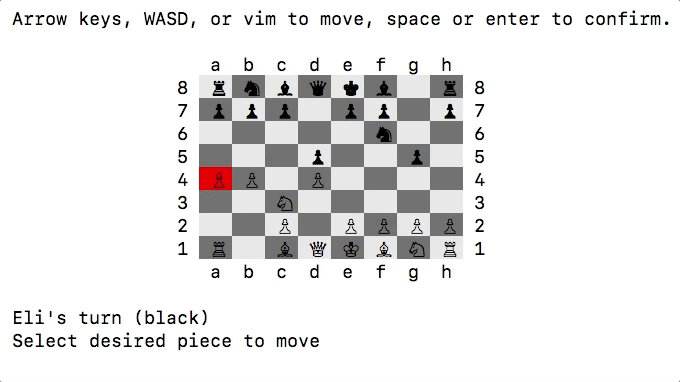

# Chess
Play a fully-interactive chess through the terminal!  
This version of chess, written in ruby, provides easy access to beginners by highlighting possible moves as well as providing verbal cues for check and checkmate.

This game was implemented in an OOP fashion, utilizing Ruby's modules and class inheritance.

#### to play:
Clone this repo and run `ruby game.rb` in the console.

1. To move the cursor, use the W, A, S and D keys
2. To select a piece use the RETURN / SPACE keys
3. Yellow squares indicate possible moves
4. Press CTRL+C to quit

Rules: [Wikipedia](https://en.wikipedia.org/wiki/Chess#Rules)

## Demo


## Features

#### Slideable and Stepable Piece Inheritance
All of the individual pieces inherit from the Piece class, slideable pieces (Bishop, Rook, Queen) behavior is determined by the Slideable module while the stepable pieces (King, Knight) behavior is determined by the Stepable module

#### Cursor
The Cursor class allows for interaction through the keyboard

```
def read_char
  STDIN.echo = false
  STDIN.raw!
  input = STDIN.getc.chr

  if input == "\e" then
    input << STDIN.read_nonblock(3) rescue nil
    input << STDIN.read_nonblock(2) rescue nil
  end

  STDIN.echo = true
  STDIN.cooked!

  return input
end

def handle_key(key)
  case key
  when :return, :space
    toggle_selected
    cursor_pos
  when :left, :right, :up, :down
    update_pos(MOVES[key])
    nil
  when :ctrl_c
    Process.exit(0)
  else
    puts key
  end
```

## Future Features
- [ ] Add special moves (En Passant, Castling, Pawn Promotion)
- [ ] Add computer player AI
